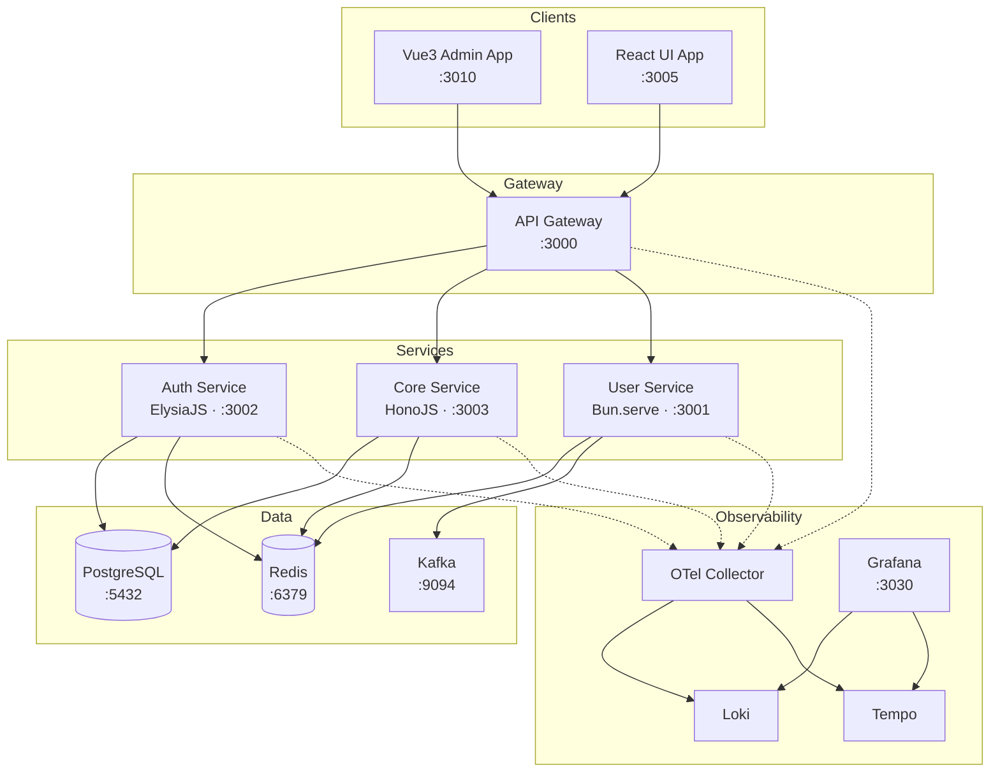
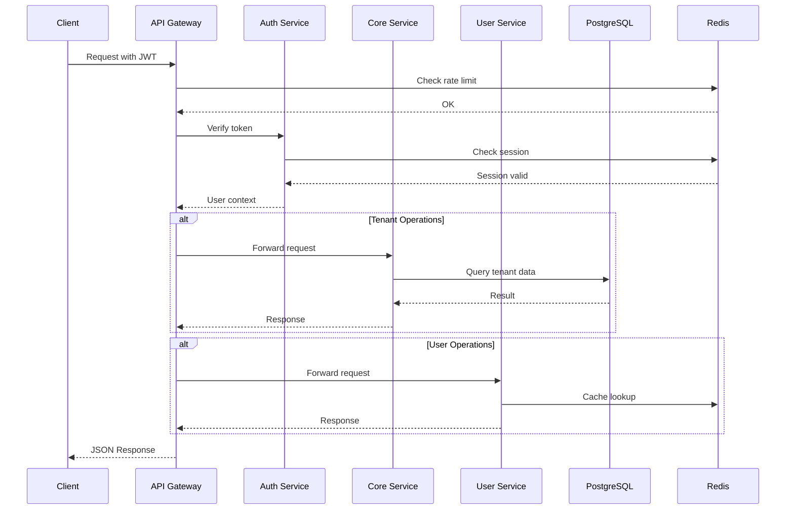
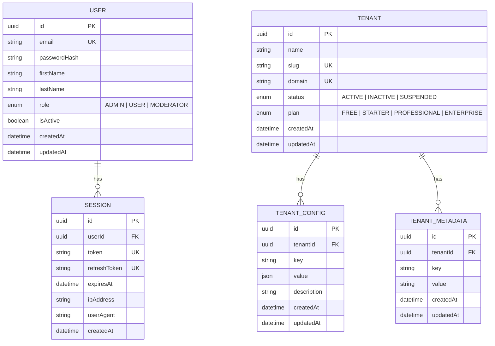
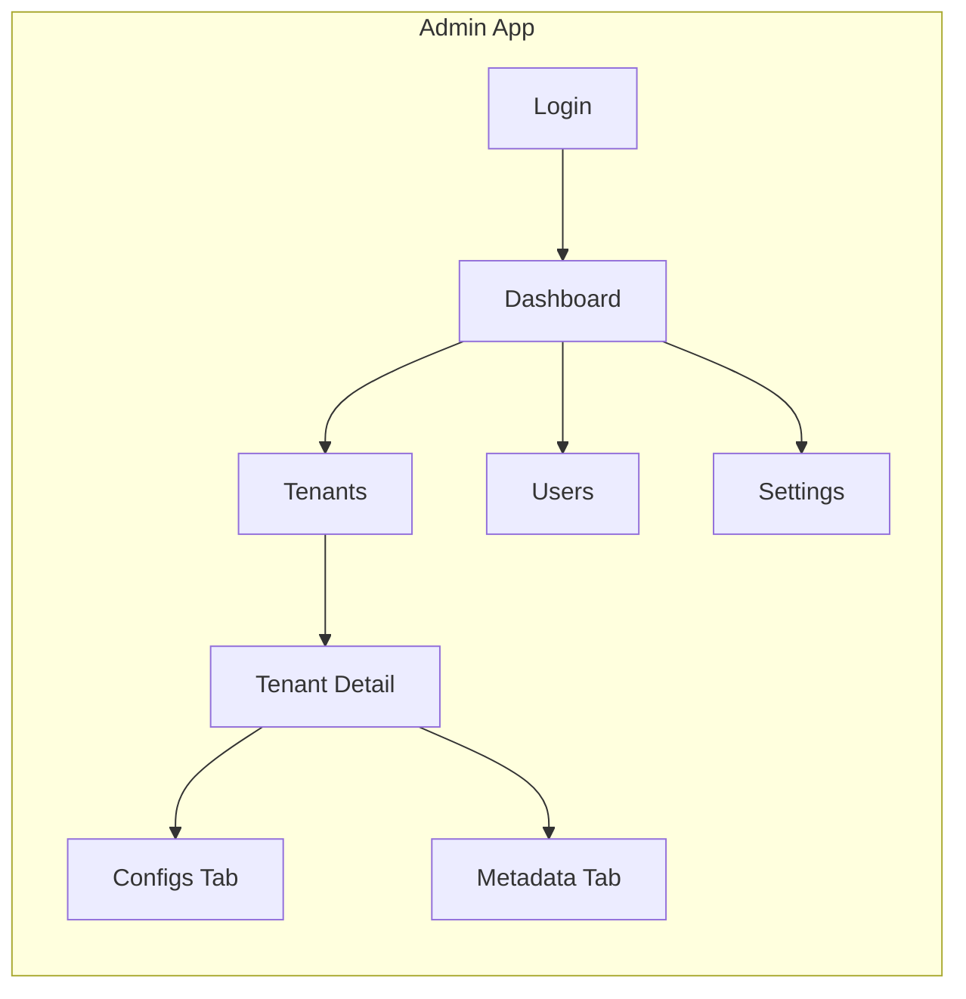

# Bun Playground — Microservices Monorepo

A modern, cloud-native microservices monorepo powered by **Bun** runtime, **Turborepo** for build orchestration, and a full observability stack. Designed for rapid development with type-safe services, event-driven architecture, and production-ready infrastructure.

---

## Table of Contents

- [Architecture Overview](#architecture-overview)
- [Service Communication Flow](#service-communication-flow)
- [Data Model](#data-model)
- [Project Structure](#project-structure)
  - [Apps](#apps)
    - [Admin Dashboard](#admin-dashboard-apps-admin--3010)
    - [React UI](#react-ui-apps-ui--3005)
  - [Services](#services)
    - [API Gateway](#api-gateway-3000)
    - [Auth Service](#auth-service-3002)
    - [Core Service](#core-service-3003)
    - [User Service](#user-service-3001)
  - [Libs](#libs)
    - [shared-types](#shared-types-libs-shared-types)
    - [shared-utils](#shared-utils-libs-shared-utils)
    - [shared-testing](#shared-testing-libs-shared-testing)
  - [Infrastructure](#infrastructure)
    - [Docker Compose](#docker-compose)
    - [Kubernetes](#kubernetes)
    - [Terraform](#terraform)
- [Quick Start](#quick-start)
- [Development](#development)
  - [Linting](#linting)
  - [Testing](#testing)
  - [Database (Prisma)](#database-prisma)
- [Tech Stack](#tech-stack)
- [Environment Variables](#environment-variables)
- [License](#license)

---

## Architecture Overview



## Service Communication Flow



## Data Model



---

## Project Structure

```
bun-playground/
├── apps/
│   ├── admin/                         # Vue 3 admin dashboard (:3010)
│   │   ├── src/
│   │   │   ├── components/
│   │   │   │   ├── common/            # ConfirmDialog, StatusBadge, LoadingSpinner, DataTable
│   │   │   │   ├── layout/            # AppLayout, AppHeader, AppSidebar, AppBreadcrumb
│   │   │   │   └── tenants/           # TenantCard, TenantForm
│   │   │   ├── composables/           # useAuth, useApi, usePagination
│   │   │   ├── stores/                # Pinia stores (auth, tenant, ui)
│   │   │   ├── types/                 # TypeScript types (auth, tenant, common)
│   │   │   ├── utils/                 # api-client, format helpers
│   │   │   ├── __tests__/             # Unit tests
│   │   │   ├── App.vue
│   │   │   ├── main.ts
│   │   │   └── index.html
│   │   └── package.json
│   └── ui/                            # React 19 frontend app (:3005)
│       ├── src/
│       │   ├── components/ui/         # Radix UI wrappers (button, card, input, etc.)
│       │   ├── lib/                   # Utility functions (cn)
│       │   ├── __tests__/             # Unit tests
│       │   ├── App.tsx
│       │   ├── APITester.tsx
│       │   ├── frontend.tsx
│       │   └── index.html
│       ├── styles/                    # CSS assets
│       ├── build.ts                   # Custom Bun build script
│       └── package.json
├── services/
│   ├── api-gateway/                   # API Gateway (:3000)
│   │   ├── src/
│   │   │   ├── middleware/            # rate-limiter, auth proxy
│   │   │   ├── routes/               # service-routes (path → service mapping)
│   │   │   ├── __tests__/            # Unit tests
│   │   │   ├── index.ts              # Bun.serve() entry point
│   │   │   ├── config.ts
│   │   │   └── health.ts
│   │   └── package.json
│   ├── auth-service/                  # Auth Service — ElysiaJS (:3002)
│   │   ├── src/
│   │   │   ├── middleware/            # JWT/CASL authenticate middleware
│   │   │   ├── __tests__/            # Unit tests
│   │   │   ├── index.ts
│   │   │   ├── app.ts
│   │   │   ├── config.ts
│   │   │   └── prisma.ts
│   │   ├── prisma/
│   │   │   └── schema.prisma         # User + Session models
│   │   └── package.json
│   ├── core-service/                  # Core Service — Hono (:3003)
│   │   ├── src/
│   │   │   ├── handlers/             # Business logic handlers
│   │   │   ├── middleware/            # request-id, error-handler, tenant-context
│   │   │   ├── models/               # Data models (tenant, config, metadata)
│   │   │   ├── repositories/         # Data access layer
│   │   │   ├── routes/               # Route definitions
│   │   │   ├── services/             # Service layer
│   │   │   ├── utils/                # Response formatting
│   │   │   ├── __tests__/            # Unit tests
│   │   │   ├── index.ts
│   │   │   ├── app.ts
│   │   │   ├── config.ts
│   │   │   └── prisma.ts
│   │   ├── prisma/
│   │   │   └── schema.prisma         # Tenant, TenantConfig, TenantMetadata models
│   │   └── package.json
│   └── user-service/                  # User Service — Bun.serve() (:3001)
│       ├── src/
│       │   ├── events/                # Kafka event definitions
│       │   ├── handlers/              # Request handlers
│       │   ├── models/                # User model
│       │   ├── repositories/          # SQLite data access
│       │   ├── routes/                # Route definitions
│       │   ├── services/              # Business logic
│       │   ├── __tests__/             # Unit tests
│       │   ├── index.ts
│       │   ├── config.ts
│       │   └── health.ts
│       └── package.json
├── libs/
│   ├── shared-types/                  # Shared TypeScript types & interfaces
│   │   ├── src/
│   │   │   ├── enums/                 # HttpStatus, ServiceName
│   │   │   ├── interfaces/            # ServiceResponse, ServiceConfig, etc.
│   │   │   ├── types/                 # BaseEntity, ID, Timestamp, JSONValue
│   │   │   ├── events/                # User event type definitions
│   │   │   ├── __tests__/             # Unit tests
│   │   │   └── index.ts
│   │   └── package.json
│   ├── shared-utils/                  # Shared utilities & middleware
│   │   ├── src/
│   │   │   ├── middleware/            # request-id, error-handler, CORS
│   │   │   ├── kafka/                 # Producer & consumer wrappers
│   │   │   ├── __tests__/             # Unit tests
│   │   │   ├── index.ts
│   │   │   ├── logger.ts             # Structured JSON logger
│   │   │   ├── config.ts             # Config loaders (service, Kafka, Redis)
│   │   │   ├── http-client.ts        # Inter-service HTTP client with retries
│   │   │   └── redis.ts              # Redis cache helpers
│   │   └── package.json
│   └── shared-testing/                # Shared test helpers
│       ├── src/
│       │   ├── __tests__/             # Self-tests for fixtures
│       │   ├── index.ts
│       │   ├── mocks.ts              # Mock Request/Response/Logger factories
│       │   ├── fixtures.ts           # Test data factories (user, tenant, session)
│       │   └── assertions.ts         # Custom HTTP response assertions
│       └── package.json
├── packages/                          # Additional packages (reserved)
├── infrastructure/
│   ├── docker/                        # Docker Compose setup
│   │   ├── docker-compose.yml         # PostgreSQL, Redis, Kafka, OTel, Grafana
│   │   ├── init-databases.sh
│   │   ├── otel-collector-config.yaml
│   │   ├── tempo-config.yaml
│   │   ├── loki-config.yaml
│   │   └── grafana/provisioning/      # Grafana data source configs
│   ├── k8s/                           # Kubernetes (Kustomize)
│   │   ├── overlays/
│   │   │   ├── dev/                   # 1 replica, debug logging
│   │   │   └── prod/                  # 3 replicas, increased resources
│   │   └── platform/                  # Shared platform (Loki, Redis, Grafana)
│   └── terraform/                     # Infrastructure as Code
│       ├── modules/                   # Reusable Terraform modules
│       │   ├── networking/            # VPC/VNet, subnets, security groups
│       │   ├── database/              # PostgreSQL (RDS/Cloud SQL/Azure DB)
│       │   ├── cache/                 # Redis (ElastiCache/Memorystore/Azure Cache)
│       │   ├── messaging/             # Kafka (MSK/Event Hubs)
│       │   └── container/             # Container services (ECS/Cloud Run/Container Apps)
│       ├── aws/                       # AWS deployment (ECS Fargate, RDS, ElastiCache, MSK)
│       ├── gcp/                       # GCP deployment (Cloud Run, Cloud SQL, Memorystore)
│       ├── azure/                     # Azure deployment (Container Apps, Azure DB, Event Hubs)
│       └── README.md                  # Terraform guidelines & usage
├── eslint.config.ts                   # ESLint flat config (TypeScript)
├── tsconfig.json                      # Root TypeScript config (strict, ESNext, bundler)
├── turbo.json                         # Turborepo task configuration
├── package.json                       # Workspace root
├── Makefile                           # Developer commands
├── CLAUDE.md                          # AI assistant guidelines
└── .env.example                       # Environment variable template
```

---

## Apps

### Admin Dashboard (`apps/admin` — `:3010`)

| Aspect | Detail |
|--------|--------|
| **Framework** | Vue 3 (Composition API) |
| **State** | Pinia |
| **Routing** | Vue Router |
| **Styling** | TailwindCSS v4 |
| **Utilities** | VueUse |

**Pages:** Login, Dashboard, Tenants (list + detail), Users, Settings



### React UI (`apps/ui` — `:3005`)

| Aspect | Detail |
|--------|--------|
| **Framework** | React 19 |
| **UI Components** | Radix UI (label, select, slot) |
| **Styling** | TailwindCSS v4, tailwind-merge |
| **Icons** | Lucide React |

React 19 frontend with Radix UI components, TailwindCSS, and an API testing interface.

---

## Services

### API Gateway (`:3000`)

| Aspect | Detail |
|--------|--------|
| **Runtime** | Bun.serve() |
| **Responsibility** | Request routing, rate limiting, authentication proxy |
| **Dependencies** | Redis (rate limiting cache) |

Routes all client requests to downstream services. Performs JWT verification via the Auth Service before forwarding. Implements sliding-window rate limiting backed by Redis.

### Auth Service (`:3002`)

| Aspect | Detail |
|--------|--------|
| **Framework** | [ElysiaJS](https://elysiajs.com/) |
| **Auth** | JWT access + refresh tokens |
| **Authorization** | [CASL](https://casl.js.org/) role-based abilities |
| **Database** | PostgreSQL via Prisma ORM |
| **Storage** | Redis (session cache) |

**Key endpoints:**

| Method | Path | Description |
|--------|------|-------------|
| `POST` | `/auth/register` | Register a new user |
| `POST` | `/auth/login` | Login, returns JWT + refresh token |
| `POST` | `/auth/refresh` | Refresh access token |
| `POST` | `/auth/logout` | Invalidate session |
| `GET`  | `/auth/me` | Get current authenticated user |
| `GET`  | `/sessions` | List active sessions |
| `DELETE` | `/sessions/:id` | Revoke a session |

**CASL Roles:**
- **ADMIN** — manage all resources
- **MODERATOR** — read all, update users, manage sessions
- **USER** — read/update own profile, manage own sessions

### Core Service (`:3003`)

| Aspect | Detail |
|--------|--------|
| **Framework** | [Hono](https://hono.dev/) |
| **Responsibility** | Multi-tenant management |
| **Database** | PostgreSQL via Prisma ORM |

**Key endpoints:**

| Method | Path | Description |
|--------|------|-------------|
| `POST` | `/api/v1/tenants` | Create tenant |
| `GET` | `/api/v1/tenants` | List tenants (paginated) |
| `GET` | `/api/v1/tenants/:id` | Get tenant |
| `PATCH` | `/api/v1/tenants/:id` | Update tenant |
| `DELETE` | `/api/v1/tenants/:id` | Deactivate tenant |
| `GET` | `/api/v1/tenants/:id/configs` | List tenant configs |
| `PUT` | `/api/v1/tenants/:id/configs/:key` | Upsert config |
| `DELETE` | `/api/v1/tenants/:id/configs/:key` | Delete config |
| `GET` | `/api/v1/tenants/:id/metadata` | List metadata |
| `PUT` | `/api/v1/tenants/:id/metadata/:key` | Upsert metadata |
| `DELETE` | `/api/v1/tenants/:id/metadata/:key` | Delete metadata |

### User Service (`:3001`)

| Aspect | Detail |
|--------|--------|
| **Runtime** | Bun.serve() |
| **Responsibility** | User CRUD, event publishing |
| **Storage** | SQLite (bun:sqlite) |
| **Events** | Kafka (user lifecycle events) |
| **Cache** | Redis |

---

## Libs

### shared-types (`libs/shared-types`)

Shared TypeScript types, enums, and interfaces used across all services.

| Export | Description |
|--------|-------------|
| `HttpStatus` | HTTP status code enum (200, 201, 400, 401, 404, 500, etc.) |
| `ServiceName` | Service name enum (api-gateway, auth-service, core-service, user-service) |
| `ServiceResponse<T>` | Standard API response wrapper |
| `PaginatedResponse<T>` | Paginated response with metadata |
| `ServiceConfig` | Service configuration interface |
| `KafkaConfig` | Kafka connection config |
| `RedisConfig` | Redis connection config |
| `BaseEntity` | Base entity with id, createdAt, updatedAt |

### shared-utils (`libs/shared-utils`)

Shared utilities, middleware, and clients for inter-service communication.

| Export | Description |
|--------|-------------|
| `Logger` / `createLogger` | Structured JSON logger with level filtering |
| `loadServiceConfig` | Load service config from env vars |
| `loadKafkaConfig` | Load Kafka config from env vars |
| `loadRedisConfig` | Load Redis config from env vars |
| `HttpClient` | HTTP client with retries and timeouts |
| `getRequestId` / `withRequestId` | Request ID middleware |
| `createErrorResponse` / `handleError` | Error response helpers |
| `corsHeaders` / `handleCorsPreFlight` | CORS utilities |
| `getRedisClient` / `cacheGet` / `cacheSet` / `cacheDelete` | Redis cache helpers |
| Kafka producer / consumer | Kafka event wrappers |

### shared-testing (`libs/shared-testing`)

Shared test helpers for writing unit and integration tests across the monorepo.

| Export | Description |
|--------|-------------|
| `createMockRequest` | Create mock `Request` objects with configurable method, URL, headers, body |
| `createMockResponse` | Create mock JSON `Response` objects |
| `createMockLogger` | Create a spy logger that records all calls |
| `createTestUser` | Factory for test user fixtures |
| `createTestTenant` | Factory for test tenant fixtures |
| `createTestSession` | Factory for test session fixtures |
| `createTestServiceConfig` | Factory for test service config fixtures |
| `assertJsonResponse` | Assert response status and parse JSON body |
| `assertErrorResponse` | Assert error response shape |
| `assertPaginatedResponse` | Assert paginated response shape |

---

## Infrastructure

### Docker Compose

All platform services run via a single `docker-compose.yml`:

```bash
make docker-up      # Start all services
make docker-down    # Stop all services
make docker-logs    # Tail container logs
make docker-clean   # Stop + remove volumes
```

**Platform services:** PostgreSQL 16, Redis 7.4, Kafka 3.9
**Observability:** OpenTelemetry Collector, Loki (logs), Tempo (traces), Grafana (dashboards at `:3030`)

### Kubernetes

Production-ready Kustomize manifests with `dev` and `prod` overlays:

```bash
make k8s-dev        # Deploy dev overlay (1 replica, debug logging)
make k8s-prod       # Deploy prod overlay (3 replicas, increased resources)
make k8s-status     # Show K8s resource status
make k8s-delete     # Delete all K8s resources
```

### Terraform

Multi-cloud Infrastructure as Code supporting AWS, GCP, and Azure. See [`infrastructure/terraform/README.md`](infrastructure/terraform/README.md) for detailed guidelines.

| Cloud | Compute | Database | Cache | Messaging |
|-------|---------|----------|-------|-----------|
| **AWS** | ECS Fargate | RDS PostgreSQL 16 | ElastiCache Redis 7 | Amazon MSK |
| **GCP** | Cloud Run | Cloud SQL PostgreSQL 16 | Memorystore Redis 7 | Managed Kafka |
| **Azure** | Container Apps | Azure DB for PostgreSQL | Azure Cache for Redis | Event Hubs |

```bash
cd infrastructure/terraform/aws   # or gcp, azure
cp terraform.tfvars.example terraform.tfvars
terraform init
terraform plan
terraform apply
```

---

## Quick Start

```bash
# 1. Install dependencies
make install

# 2. Copy environment file
cp .env.example .env

# 3. Start infrastructure (PostgreSQL, Redis, Kafka, etc.)
make docker-up

# 4. Generate Prisma clients
make db-generate

# 5. Run database migrations
make db-migrate

# 6. Start all services in dev mode
make dev
```

---

## Development

### Linting

ESLint is configured with TypeScript support via a flat config (`eslint.config.ts`). Run across all workspaces:

```bash
make lint           # Lint all workspaces via Turborepo
bun run lint:root   # Lint from root (all files)
```

Each workspace also has its own lint script:

```bash
cd services/api-gateway && bun run lint
```

### Testing

Tests use `bun:test` across all workspaces. Shared test helpers are available via `@bun-playground/shared-testing`.

```bash
make test                      # Run all tests recursively
bun test libs/                 # Test shared libraries
bun test services/api-gateway  # Test a specific service
```

**Writing tests:** Import helpers from the shared testing library:

```ts
import { createTestUser, assertJsonResponse } from "@bun-playground/shared-testing";
```

### Database (Prisma)

```bash
make db-generate    # Generate Prisma clients
make db-migrate     # Run migrations (dev)
make db-push        # Push schema (no migration files)
make db-studio      # Open Prisma Studio
```

---

## Tech Stack

| Layer | Technology |
|-------|-----------|
| Runtime | Bun 1.3 |
| Build | Turborepo |
| Linting | ESLint + typescript-eslint (flat config) |
| Testing | bun:test + shared-testing helpers |
| API Gateway | Bun.serve() |
| Auth Service | ElysiaJS + JWT + CASL |
| Core Service | Hono |
| User Service | Bun.serve() + bun:sqlite |
| Admin Frontend | Vue 3 + Pinia + Vue Router |
| UI Frontend | React 19 + Radix UI |
| ORM | Prisma (PostgreSQL) |
| Cache | Redis |
| Events | Kafka |
| Observability | OpenTelemetry + Loki + Tempo + Grafana |
| IaC | Terraform (AWS / GCP / Azure) |
| Containers | Docker Compose / Kubernetes (Kustomize) |

## Environment Variables

Copy `.env.example` to `.env` and adjust values:

```bash
cp .env.example .env
```

See `.env.example` for all available configuration options.

---

## License

Private — Internal use only.
