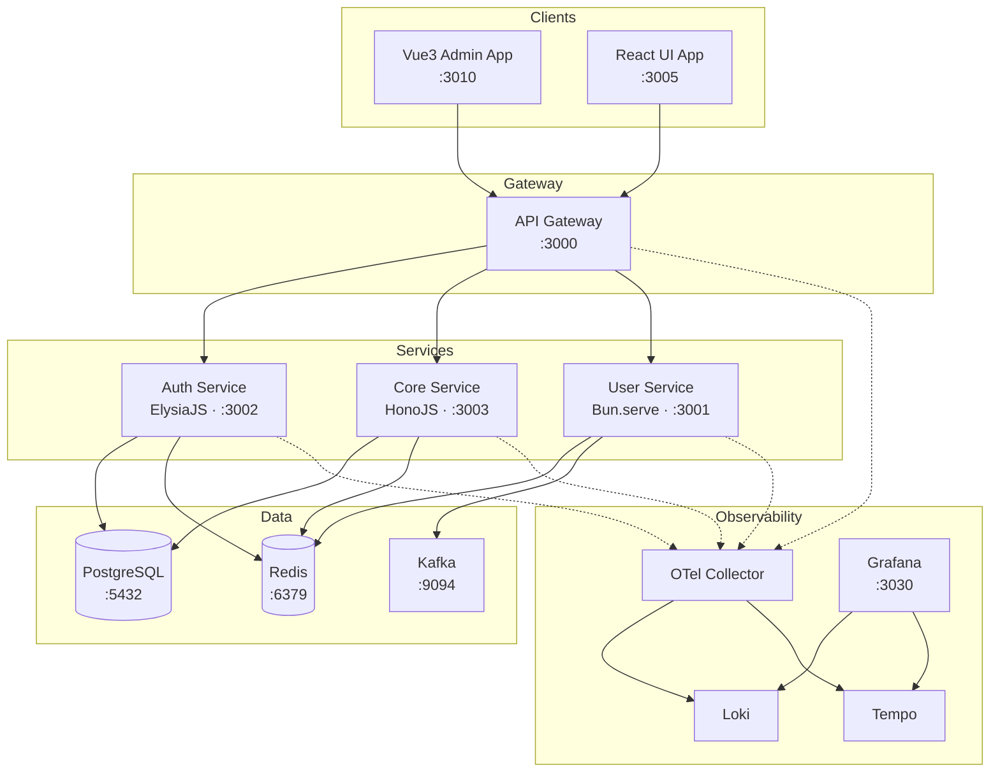
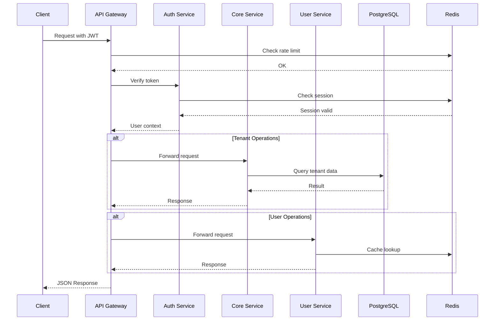
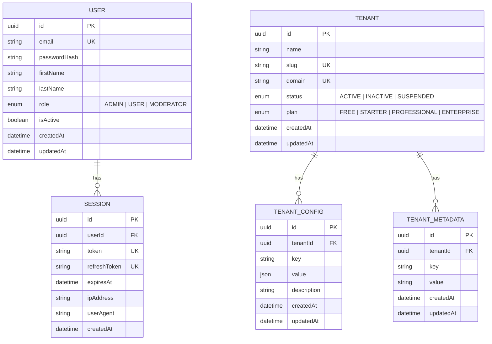
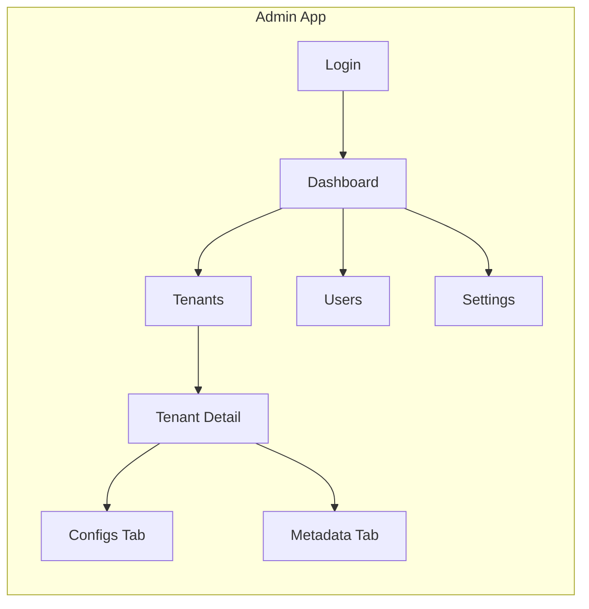

# Bun Playground — Microservices Monorepo

A modern, cloud-native microservices monorepo powered by **Bun** runtime, **Turborepo** for build orchestration, and a full observability stack. Designed for rapid development with type-safe services, event-driven architecture, and production-ready infrastructure.

## Architecture Overview



## Service Communication Flow



## Data Model



## Monorepo Structure

```
bun-playground/
├── apps/
│   ├── admin/              # Vue3 admin dashboard
│   └── ui/                 # React frontend app
├── libs/
│   ├── shared-types/       # Shared TypeScript types, enums, interfaces
│   └── shared-utils/       # Shared middleware, clients, logger
├── services/
│   ├── api-gateway/        # API Gateway — routing, rate limiting, auth
│   ├── auth-service/       # Auth — JWT, sessions, CASL authorization
│   ├── core-service/       # Core — tenant management, configs, metadata
│   └── user-service/       # User — CRUD, events
├── infrastructure/
│   ├── docker/             # Docker Compose setup
│   └── k8s/                # Kubernetes manifests (Kustomize)
├── turbo.json              # Turborepo task configuration
├── package.json            # Workspace root
└── Makefile                # Developer commands
```

---

## Services

### API Gateway (`:3000`)

| Aspect | Detail |
|--------|--------|
| **Runtime** | Bun.serve() |
| **Responsibility** | Request routing, rate limiting, authentication proxy |
| **Dependencies** | Redis (rate limiting cache) |

Routes all client requests to downstream services. Performs JWT verification via the Auth Service before forwarding. Implements sliding-window rate limiting backed by Redis.

### Auth Service (`:3002`)

| Aspect | Detail |
|--------|--------|
| **Framework** | [ElysiaJS](https://elysiajs.com/) |
| **Auth** | JWT access + refresh tokens |
| **Authorization** | [CASL](https://casl.js.org/) role-based abilities |
| **Database** | PostgreSQL via Prisma ORM |
| **Storage** | Redis (session cache) |

**Key endpoints:**

| Method | Path | Description |
|--------|------|-------------|
| `POST` | `/auth/register` | Register a new user |
| `POST` | `/auth/login` | Login, returns JWT + refresh token |
| `POST` | `/auth/refresh` | Refresh access token |
| `POST` | `/auth/logout` | Invalidate session |
| `GET`  | `/auth/me` | Get current authenticated user |
| `GET`  | `/sessions` | List active sessions |
| `DELETE` | `/sessions/:id` | Revoke a session |

**CASL Roles:**
- **ADMIN** — manage all resources
- **MODERATOR** — read all, update users, manage sessions
- **USER** — read/update own profile, manage own sessions

### Core Service (`:3003`)

| Aspect | Detail |
|--------|--------|
| **Framework** | [Hono](https://hono.dev/) |
| **Responsibility** | Multi-tenant management |
| **Database** | PostgreSQL via Prisma ORM |

**Key endpoints:**

| Method | Path | Description |
|--------|------|-------------|
| `POST` | `/api/v1/tenants` | Create tenant |
| `GET` | `/api/v1/tenants` | List tenants (paginated) |
| `GET` | `/api/v1/tenants/:id` | Get tenant |
| `PATCH` | `/api/v1/tenants/:id` | Update tenant |
| `DELETE` | `/api/v1/tenants/:id` | Deactivate tenant |
| `GET` | `/api/v1/tenants/:id/configs` | List tenant configs |
| `PUT` | `/api/v1/tenants/:id/configs/:key` | Upsert config |
| `DELETE` | `/api/v1/tenants/:id/configs/:key` | Delete config |
| `GET` | `/api/v1/tenants/:id/metadata` | List metadata |
| `PUT` | `/api/v1/tenants/:id/metadata/:key` | Upsert metadata |
| `DELETE` | `/api/v1/tenants/:id/metadata/:key` | Delete metadata |

### User Service (`:3001`)

| Aspect | Detail |
|--------|--------|
| **Runtime** | Bun.serve() |
| **Responsibility** | User CRUD, event publishing |
| **Events** | Kafka (user lifecycle events) |
| **Cache** | Redis |

---

## Frontend Applications

### Admin Dashboard (`apps/admin` — `:3010`)

| Aspect | Detail |
|--------|--------|
| **Framework** | Vue 3 (Composition API) |
| **State** | Pinia |
| **Routing** | Vue Router |
| **Styling** | TailwindCSS v4 |
| **Utilities** | VueUse |

**Pages:** Login, Dashboard, Tenants (list + detail), Users, Settings



### React UI (`apps/ui` — `:3005`)

React 19 frontend with Radix UI components and TailwindCSS. Includes an API testing interface.

---

## Infrastructure

### Docker Compose

All services run via a single `docker-compose.yml`:

```bash
make docker-up      # Start all services
make docker-down    # Stop all services
make docker-logs    # Tail container logs
make docker-clean   # Stop + remove volumes
```

**Platform services:** PostgreSQL 16, Redis 7.4, Kafka 3.9
**Observability:** OpenTelemetry Collector, Loki (logs), Tempo (traces), Grafana (dashboards)

### Kubernetes

Production-ready Kustomize manifests with `dev` and `prod` overlays:

```bash
make k8s-dev        # Deploy dev overlay (1 replica, debug logging)
make k8s-prod       # Deploy prod overlay (3 replicas, increased resources)
```

### Database (Prisma)

```bash
make db-generate    # Generate Prisma clients
make db-migrate     # Run migrations (dev)
make db-push        # Push schema (no migration files)
make db-studio      # Open Prisma Studio
```

---

## Quick Start

```bash
# 1. Install dependencies
make install

# 2. Copy environment file
cp .env.example .env

# 3. Start infrastructure (PostgreSQL, Redis, Kafka, etc.)
make docker-up

# 4. Generate Prisma clients
make db-generate

# 5. Run database migrations
make db-migrate

# 6. Start all services in dev mode
make dev
```

## Tech Stack

| Layer | Technology |
|-------|-----------|
| Runtime | Bun 1.3 |
| Build | Turborepo |
| API Gateway | Bun.serve() |
| Auth Service | ElysiaJS + JWT + CASL |
| Core Service | Hono |
| User Service | Bun.serve() |
| Admin Frontend | Vue 3 + Pinia + Vue Router |
| UI Frontend | React 19 + Radix UI |
| ORM | Prisma (PostgreSQL) |
| Cache | Redis |
| Events | Kafka |
| Observability | OpenTelemetry + Loki + Tempo + Grafana |
| Containers | Docker Compose / Kubernetes (Kustomize) |

## Environment Variables

Copy `.env.example` to `.env` and adjust values:

```bash
cp .env.example .env
```

See `.env.example` for all available configuration options.

---

## License

Private — Internal use only.
